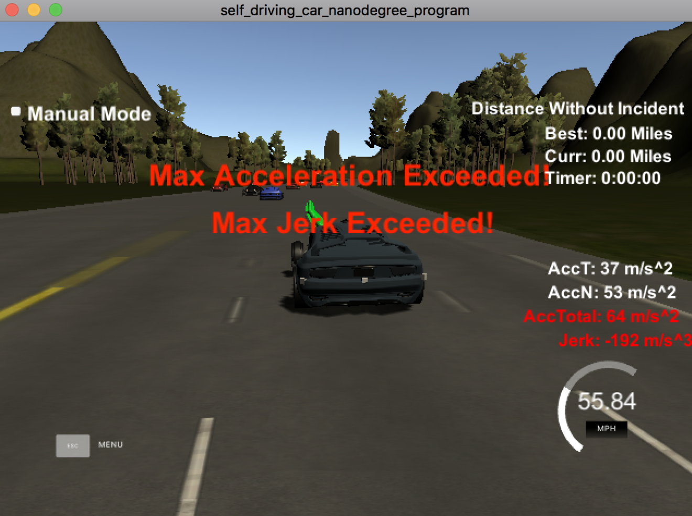
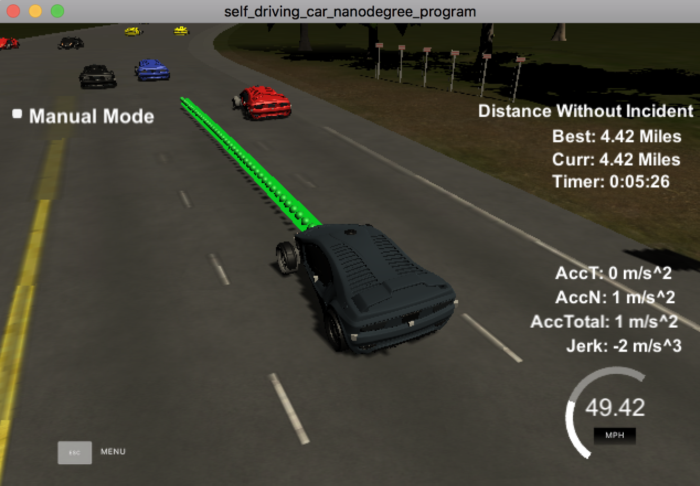

 ### Path Generation Project
[](http://www.udacity.com/drive)


### PART 3: Sensor Fusion, Localization, and Control
### Project 1: Path Planning

#### Goals
In this project, The goal is to safely navigate around a virtual highway with other traffic that is driving +-10 MPH of the 50 MPH speed limit. The car's localization and sensor fusion data, as well as sparse map list of waypoints around the highway, are provided. The car should try to go as close as possible to the 50 MPH speed limit, which means passing slower traffic when possible, note that other cars will try to change lanes too. The car should avoid hitting other cars at all cost as well as driving inside of the marked road lanes at all times, unless going from one lane to another. The car should be able to make one complete loop around the 6946m highway. Since the car is trying to go 50 MPH, it should take a little over 5 minutes to complete 1 loop. Also, the car should not experience total acceleration over 10 m/s^2 and jerk that is greater than 10 m/s^3.

#### Analysis
To meet the project goal, the car should: 
1. drive as fast as permitted;
2. change lane if necessary but avoid accidents of any kind;
3. keep jerks as low as possible.

#### My solution
I followed the method introduced in the project walkthrough closely. 
 
First, I used the starting code from the project to make the car move along a straight line which took with the previous yaw as the direction.
  
 ```python

double dist_inc = 0.5;
for(int i = 0; i < 50; i++)
{
      next_x_vals.push_back(car_x+(dist_inc*i)*cos(deg2rad(car_yaw)));
      next_y_vals.push_back(car_y+(dist_inc*i)*sin(deg2rad(car_yaw)));
}
    
```
  
The car would run off the lane quickly because the lanes are not straight. So I used the frenet coordinates to make the car run on the same lane.
`next_d` makes sure the car stay in the middle of the current lane, and `next_s` let the car move forward. Then I transformed Frenet s,d coordinates to Cartesian x,y
because the controller of the car consumes Cartesian coordinates.

```python

double dist_inc = 0.5;
for(int i = 0; i < 50; i++)
{
    double next_s = car_s+(i+1)*dist_inc;
    double next_d = lane*4+2;
    vector<double> xy = getXY(next_s, next_d, map_waypoints_s, map_waypoints_x, map_waypoints_y);
    next_x_vals.push_back(xy[0]);
    next_y_vals.push_back(xy[1]);
}
            
```

The car was able to advance without running off the lane, but the jerks were way too high because there was no buffer between the planned paths.
The car reached the max speed suddenly and reduced to 0 mph suddenly and again drove at the max speed, and so on so forth.



The planner created some buffers so the car could slow down and speed up smoothly. There were two parts to the solution:

Part 1: planner took some points from the previous path as the starting points for planning next path

```python

vector<double> ptsx;
vector<double> ptsy;

double ref_x = car_x;
double ref_y = car_y;
double ref_yaw = deg2rad(car_yaw);

if (prev_size < 2) {
    double prev_car_x = car_x - cos(car_yaw);
    double prev_car_y = car_y - sin(car_yaw);

    ptsx.push_back(prev_car_x);
    ptsx.push_back(car_x);

    ptsy.push_back(prev_car_y);
    ptsy.push_back(car_y);
} else {
    ref_x = previous_path_x[prev_size - 1];
    ref_y = previous_path_y[prev_size - 1];

    double ref_x_prev = previous_path_x[prev_size - 2];
    double ref_y_prev = previous_path_y[prev_size - 2];

    ptsx.push_back(ref_x_prev);
    ptsx.push_back(ref_x);

    ptsy.push_back(ref_y_prev);
    ptsy.push_back(ref_y);
}


vector<double> next_wp0 = getXY(car_s + 30, (2 + 4 * lane), map_waypoints_s, map_waypoints_x,
                                map_waypoints_y);
vector<double> next_wp1 = getXY(car_s + 60, (2 + 4 * lane), map_waypoints_s, map_waypoints_x,
                                map_waypoints_y);
vector<double> next_wp2 = getXY(car_s + 90, (2 + 4 * lane), map_waypoints_s, map_waypoints_x,
                                map_waypoints_y);

ptsx.push_back(next_wp0[0]);
ptsx.push_back(next_wp1[0]);
ptsx.push_back(next_wp2[0]);

ptsy.push_back(next_wp0[1]);
ptsy.push_back(next_wp1[1]);
ptsy.push_back(next_wp2[1]);

for (int i = 0; i < ptsx.size(); i++)
{
    double shift_x = ptsx[i] - ref_x;
    double shift_y = ptsy[i] - ref_y;

    ptsx[i] = (shift_x*cos(0-ref_yaw)-shift_y*sin(0-ref_yaw));
    ptsy[i] = (shift_x*sin(0-ref_yaw)+shift_y*cos(0-ref_yaw));
}
```
Step 2:  with those points and the target location , planner used spline fitting to generate new points

```python
tk::spline s;
s.set_points(ptsx, ptsy);
vector<double> next_x_vals;
vector<double> next_y_vals;

for(int i = 0; i < previous_path_x.size(); i++)
{
    next_x_vals.push_back(previous_path_x[i]);
    next_y_vals.push_back(previous_path_y[i]);
}

double target_x = 30.0;
double target_y = s(target_x);
double target_dist = sqrt((target_x)*(target_x)+(target_y)*(target_y));

double x_add_on = 0;
for(int i = 1; i <= 50-previous_path_x.size(); i++)
{
    double N = (target_dist/(0.02*ref_val/2.24));
    double x_point = x_add_on+(target_x)/N;
    double y_point = s(x_point);

    x_add_on = x_point;

    double x_ref = x_point;
    double y_ref = y_point;

    x_point = (x_ref*cos(ref_yaw)-y_ref*sin(ref_yaw));
    y_point = (x_ref*sin(ref_yaw)+y_ref*cos(ref_yaw));

    x_point += ref_x;
    y_point += ref_y;

    next_x_vals.push_back(x_point);
    next_y_vals.push_back(y_point);
}

```

The car could move smoothly only if there were no car in front of it. To avoid a collision with the front car,
we should tell the car to reduce speed or change lanes if feasible. To keep things simple, first I only tried reducing the speed.
The problem here is detecting the cars in front of the ego car. Such information could be derived from the sensor fusion data.

For each car around the ego car, sensor provides:
 - car's unique ID
 - car's x position in map coordinates
 - car's y position in map coordinates
 - car's x velocity in m/s 
 - car's y velocity in m/s 
 - car's s position in frenet coordinates 
 - car's d position in frenet coordinates
 
 The distance between the front car and the ego car is given by `check_car_s-car_s.` If it's less than 30, it's unsafe, and the ego car needs to reduce speed.
 However, we cannot brutely reduce it to 29.5 mph cause the jerk would be too high, which is unacceptable. Therefore, in an unsafe situation, I reduced the speed gradually.
 Also, we need a strategy to speed up(within the speed limit) when it's safe to do so. When the car got back to safe mode, I increased the speed gradually.
```python
auto sensor_fusion = j[1]["sensor_fusion"];

int prev_size = previous_path_x.size();


if (prev_size > 0)
{
    car_s = end_path_s;
}
bool too_close = false;

for(int i = 0; i < sensor_fusion.size(); i++)
{
    float d = sensor_fusion[i][6];
    if(d < (2+4*lane+2) && d > (2+4*lane-2))
    {
        double vx = sensor_fusion[i][3];
        double vy = sensor_fusion[i][4];
        double check_speed = sqrt(vx*vx + vy*vy);
        double check_car_s = sensor_fusion[i][5];

        check_car_s += ((double)prev_size*.02*check_speed);

        if((check_car_s > car_s) && ((check_car_s-car_s) < 30))
        {
            //ref_val = 29.5; //mph
            too_close = true;
        }
    }

}

if(too_close)
{
    ref_val -= .224;
}
else if(ref_val < 49.5)
{
    ref_val += .224;
}

``` 

The car could safely drive on the same lane forever, but the average speed might be too low, and we want to be able to shift lanes if it's safe.
Similarly, I used the sensor fusion data to detect the cars on the left and right lanes. The strategy is:

- drive as fast as possible within the speed limit
- when approaching a car in front of it
    - move to left if there is a left lane and the lane is clear, or 
    - move to the right if there is a right lane and it's clear, or
    - slow down to avoid a collision and find a chance to move left/right or speed up
        - if there is a car behind the ego car, slow down at a moderate rate
        - otherwise, slow down at a higher rate
  

I utilized the same logic to detect the distances between the ego car and the cars around it. If the car got into an unsafe situation,
 that's `too_close_same_lane` = true, I checked `too_close_left_lane` and `too_close_right_lane` to find a same lane. If none found, the ego car reduced speed.

```python
bool too_close_same_lane_front = false;
bool too_close_same_lane_back = false;
bool too_close_left_lane = false;
bool too_close_right_lane = false;

for(int i = 0; i < sensor_fusion.size(); i++)
{

    float d = sensor_fusion[i][6];

    double vx = sensor_fusion[i][3];
    double vy = sensor_fusion[i][4];
    double check_speed = sqrt(vx*vx + vy*vy);
    double check_car_s = sensor_fusion[i][5];

    check_car_s += ((double)prev_size*.02*check_speed);

    // check cars on the same lane
    if(((check_car_s > car_s) && ((check_car_s-car_s) < 25)) || ((check_car_s < car_s) && ((car_s - check_car_s) < 15))) {
        if(d < (2+4*lane+2) && d > (2+4*lane-2))
        {
            if(check_car_s > car_s)
                too_close_same_lane_front = true;
            else
                too_close_same_lane_back = true;
        }
        // check cars on the left lane
        if ((lane > 0) && (d < (2+4*(lane-1)+2) && d > (2+4*(lane-1)-2)))
        {
            too_close_left_lane = true;
        }
        // check cars on the right lane
        if ((lane < 2) && (d < (2+4*(lane+1)+2) && d > (2+4*(lane+1)-2)))
        {
            too_close_right_lane = true;
        }
    }


}

if(too_close_same_lane_front)
{
    if(lane > 0 && !too_close_left_lane)
    {
        lane -= 1; // move left if the front car is too close
    }
    else if (lane < 2 && !too_close_right_lane)
    {
        lane += 1;
    }
    else {

        if(!too_close_same_lane_back)
        {
            ref_val -= 0.1;
        }
        else {
            ref_val -= 0.01;
        }
    }
}
else if(ref_val < 49.5)
{
    ref_val += .1;
}

```
Finally, the car was able to run one lap around the track without any accidents in 5+ minutes.


